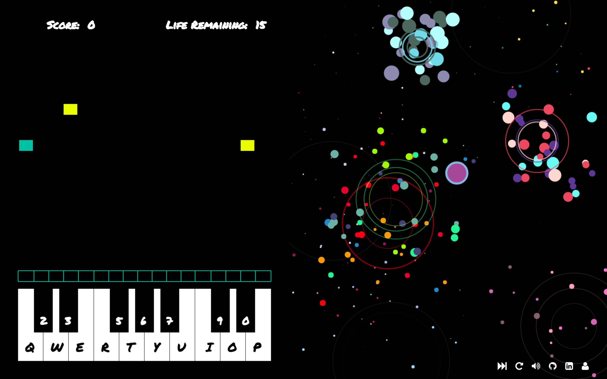

# Piano Piano Revolution

## Background

Piano Piano Revolution is an adaptation of Dance Dance Revolution.  The live version can be found at [Piano Piano Revolution][PPR].

[PPR]: http://www.shufffle.space

In the original DDR, players stand on a dance platform or stage and hit colored arrows laid out in a cross with their feet to musical and visual cues.  Players are judged by how well they time their dance to the patterns presented to them.



## Instructions

Controls are fairly simple but the game is hard because there are a LOT of keys!.  Keys corresponding to each piano key are listed inside the game.  There's also a button to increase the speed, mute button to silence the music, and reset button to refresh the page for a new game.

Visual cues are available with fireworks animation playing with each key is pressed and the user gains + 1 score for every matched pattern.  The user can earn up to 15 strikes before losing.

## Technologies & Strategies

Piano Piano Revolution is written in JavaScript, relying heavily on HTML5 Canvas, while also using jQuery.  The game runs on requestAnimationFrame and stops using cancelAnimationFrame.  A single class (game) is responsible for keeping track of the game's state data, and passes this data into various imported classes and methods in order to dynamically refresh the canvas.  The canvas is also adjusted to different window sizes and maintain fullscreen without distortion using a callback function.

```Javascript
const resizeCanvas = () => {
  canvas.width = window.innerWidth;
  canvas.height = window.innerHeight;
};
```

Another interesting aspect of Piano Piano Revolution is fireworks created using anime.js that is responsive to each key pressed and renders on another canvas.

```Javascript
const drawParticle = (x, y) => {
  let colors = colorSets[0];
  let particle = {};
  particle.x = x;
  particle.y = y;
  particle.color = colors[anime.random(0, colors.length - 1)];
  particle.radius = anime.random(fontSize(), fontSize() * 2);

  particle.draw = function() {
    ctx.beginPath();
    ctx.arc(particle.x, particle.y, particle.radius, 2 * Math.PI, false);
    ctx.fillStyle = particle.color;
    ctx.fill();
  };

  return particle;
};
```
The background music plays with the help of howler.js.

```Javascript
window.moonlight = new Howl({
  src: ['./lib/moonlight.mp3']
});

window.moonlight.play();
```

## Future Features

There are a number of additional features that are planned for this game.  First of all, a progress bar would be implemented to show their progress to completing the song. Second, add an option to add sound to each key pressed, implemented in such way that it won't collide with the background music. Lastly, more songs and levels will be added with potential of each key reflecting an actual note from a piece.
